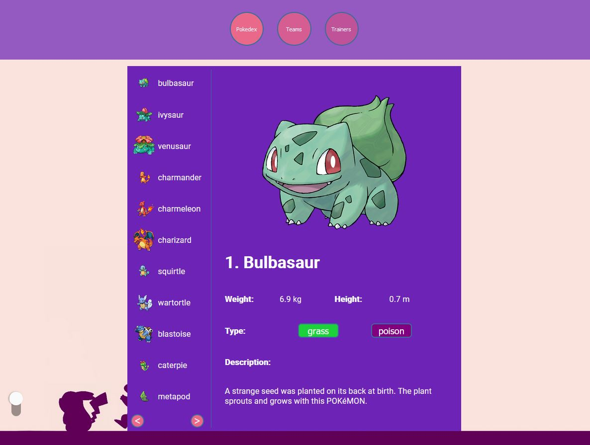

# PokeTeam

Welcome to the PokeTeam web, a website developed for Pokemon trainers. Either if you are in your first steps in the Pokemon universe or you are a Pokemon master, you will love this website. Here you can find not only the profile and information of other trainers, but also their favourite teams and information about each pokemon. 

Can't wait to try? You can visit the PokeTeam website clicking in this link (you should be a little bit patient with the loading though): https://poketeam-frontend.herokuapp.com/

But if you wish to see the inner working of PokeTeam, keep reading 🤩.

## Structure

As you can see, the project has three well differentiated parts:

- A back-end part developed in Java connected to a MySQL and a PostgreSQL database.
- A front-end part developed with Angular using HTML, CSS and TypeScript.
- And the most important part: a folder with screenshots of the website flow. Aren't they pretty?

In order to start using and digging in this project, the first step is simply click on the code button of this repository and choose one option: you can download the project as a zip and decompress it in your favourite location, or you can copy the repository url and clone it in your desired location using the git bash, for example:

1. Open the git bash in your device and travel to the most convenient location to place the project. In my case, I would like to place it in my desktop:

```
cd desktop
```

2. Execute the clone command of git, and the folder with the project will be created and completely loaded in your current location (desktop in my case). So in the git bash I would execute the command:

```
git clone https://github.com/juliagarlor/PokemonApp.git
```

Here it is. Ok, so let's describe the first two and main parts more in deep.

## Back-end: structure and how to use it

This part has been developed in Java using Maven and Spring Boot and connected to two different databases: a MySQL database for the local deploy of the application and a PosgreSQL database for the production deploy in Heroku. The backend is divided in five main folders:

- First, a model folder, containing the classes that model the main entities of the application: Pokemon, Team and Trainer. These classes are basically a description of what is a Pokemon, a Team and a Trainer from the point of view of the app and their structure is thought and optimized in order to be efficiently stored in the database. 
For example, an individual of the class Pokemon is identified by an id (that is a number), but furthermore it has its pokedex id (its species identifier in the pokedex) and a reference of its team. This means that inside the same team we can have more than one Magikarp (why not?), each of them being unique due to their unique identifier.

- The repository folder allows us to connect these models with its corresponding tables in the database, and perform queries to get certain registers from these tables. That's why each entity has its own repository since there should be a table for Pokemon, Team and Trainer.

- The controller folder contains two subfolders: one with the rest controllers of the app (impl) and another with their interfaces (interfaces). Basically, this folder describes what we can do with the app, using the routes available in the rest controllers. For example, using the route '/team/1' we can obtain the data of the team 1, this is the id of the trainer and all the pokemons inside this team. The controller folder should call the service folder in order to accomplish its functions.

- The service folder has a similar structure as that in the controller folder, but instead of rest controllers, it contains services and their interfaces. The services have all the logic behind the working of the rest controllers, so, when using the route '/team/1', we call to the .getTeam() function in TeamController, who call the .getTeam() function of the ITeamService interface, who uses the .getTeam() function of the TeamService service, who do all the work. It is a great teamwork.

- Last but not least, the utils folder contains every accessory class, enum or interface necessary for the correct working and coordination of the rest. In this case, it contains DTOs, which are meant to protect the data stored in the database. PokemonDTO, TeamDTO and TrainerDTO are a kind of copies of the corresponding entities, and we use them to show the data to the user or receive data from them without directly manipulating the precious info of our tables.

Besides, outside of the java folder of the project, at the same level, we can find the resources folder containing the application properties and the SQL file with the structure of the database.

So, let's get started with this part:

1. Choose and IDE that would allow you to work with Java. In my case, I used IntelliJ IDE for this project, but you have other options like Netbeans or Eclipse. Pick your favourite.

2. Open the backend forlder of the project with your IDE and wait a few seconds for loading the structure and dependencies of the project, this should be fast.

3. Move to the resources folder (/src/main/resources/static/pettureDBAndTables.sql) and open the application.properties file. Now look at the first three lines. These three variables should allow you to connect the java project to a MySQL database called pokemon, so first, you should create the database. Open your favourite database manager and create a new database called pokemon. I used WorkBench and executed the following lines in a file of my root user:

```
'CREATE SCHEMA pokemon;
GRANT ALL PRIVILEGES ON pokemon.* to 'myuser'@'localhost';'
```

Nevertheless, you have the complete file for creating the schema and tables in the folder static. Now, that the database is ready, go back to the java project.

4. Once the schema is created, you can change the username and password variables in the application.properties with your own used for creating the database. For example:

```
spring.datasource.username=pepeperez
spring.datasource.password=1234
```

5. We are ready to go so open your local terminal (you may find it in the IDE or just open your device's), make sure you are inside the Backend folder and execute the following command: 

```
mvn spring-boot:run
```

Once it stops, the back end project should be listening in port 8080, so you can open Postman or your favourite web navigator and test the routes of the controllers in localhost:8080, for example, try creating your trainer using the route: 

```
http://localhost:8080/new/trainer
```

and adding a name, age, hobby and a route to a photo in the body of the HTML request (you may want to use Postman for this). A complete list of possible routes is available at the end of this README, in the Back-end routes section.

## Front-end: structure and how to use it

Moving to the Frontend folder. This part has been developed in Angular, so it uses HTML, CSS, TypeScript and has some elements of Angular Materials. Although this part may seem complex, the main structure is inside the src folder, so let's have a look at it:

- The assets folder contains all the images from the website. I picked them with love, and I even painted some of them, like the day and night themes for the background. I hope you like it.

- The environments folder contains the environment files that allow the front-end to connect with the back-end both in local and production.

- The app folder may be the most important since it contains the components of the website, the models and the services, as well as the modules that it uses and the routes available from the front-end.

Looking at the app folder may feel overwhelming, but let's summarize a little bit. The components folder contains every entity on the website, from the header to the pop dialogs and different views. Each component is essentially form by an html file with the basic structure, a ts that describes the working of the component and a css which gives style. Models are similar to those found in the back-end with some additional data. And finally, services are responsible for communication with outside resources such as the backend and the amazing PokeApi (https://pokeapi.co/) which allows us to have a Pokedex view and all the pokemon data.

Ok, let's get down to business. To get the front-end started:

1. Open the Frontend folder in Angular.

2. User Ctrl+Shift+ñ to open a new terminal, or just go to the menu Terminal and choose the option.

3. Execute the following command to make sure everything is in updated and in order:

```
npm i
```

4. Ready! now execute this commad to wake up the app:

```
ng serve
```

When it stops, you will find the website up and ready in http://localhost:4200. So that's it, play and explore and have fun!


## Back-end routes

| HTTP verb | Route | Description |
| --- | --- | --- | --- | --- |
| GET | /trainer/list | Return a list of trainer names and ids |
| GET | /trainers/details | Return a list with all trainers |
| POST | /new/trainer | Register a new trainer and creates its team |
| DELETE | /remove/trainer/{id} | Delete the register of a trainer, its team and pokemons |
| GET | /team/{trainerId} | Return a team |
| PUT | /new/team-mate/{teamId} | Add an new pokemon to a team |
| PUT | /remove/team-mate/{teamId} | Remove a pokemon from its team |

**Do not forget to add "localhost:8080" before each route.**

## Front-end routes and views

HOME: http://localhost:4200 and https://poketeam-frontend.herokuapp.com/


POKEDEX: http://localhost:4200/pokedex and https://poketeam-frontend.herokuapp.com/pokedex



TEAMS: http://localhost:4200/teams and https://poketeam-frontend.herokuapp.com/teams


TRAINERS: http://localhost:4200/trainers and https://poketeam-frontend.herokuapp.com/trainers


## Thanks ❤

Special thanks to the development team of PokéAPI, they do such a great job. May you have more ideas for projects inspired in Pokemon, please, visit their page: https://pokeapi.co/. There is everything you may need, I would be all the day exploring pokeapi.

Regarding to PokeTeam, any feedback for improvement is welcome, and I hope you have fun using it.

Developed with ❤ by Julia García
